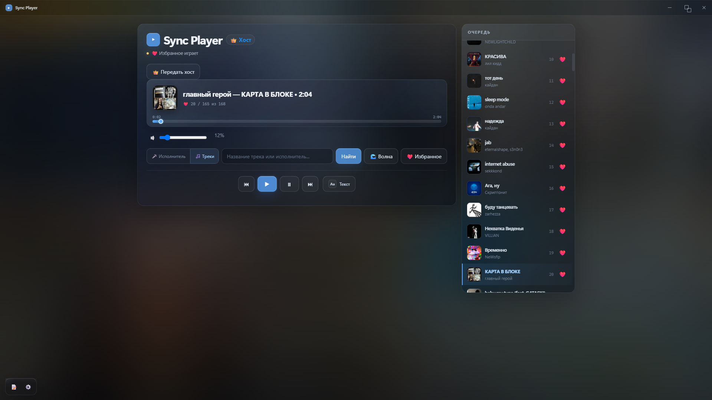

# 🎵 Sync YND Music

<p align="center">
  <strong>Слушай музыку вместе. Синхронно.</strong>
</p>

<p align="center">
  Desktop-приложение для синхронного прослушивания Яндекс Музыки.
</p>

<p align="center">


</p>

---

## ✨ Features

* 🎧 **Synchronized playback** — слушайте один трек одновременно
* 🔎 **Search** — поиск музыки прямо в приложении
* 📋 **Queue** — управление очередью воспроизведения
* ❤️ **Favorites** — работа с избранными треками
* 🌊 **Yandex Wave** — доступ к Яндекс.Волне
* 🎤 **Lyrics** — тексты песен
* 🎶 **Karaoke / LRC** — синхронизированные тексты
* 👑 **Host mode** — управление совместным прослушиванием
* 🔄 **Host transfer** — передача управления другому пользователю
* 🌐 **WebRTC** — P2P-синхронизация между клиентами
* 🖥️ **Desktop app** — работает как отдельное Electron-приложение

---

## 🎨 Preview

<p align="center">
  
</p>

---

## 🚀 Getting Started

### Requirements

* [Node.js](https://nodejs.org/)
* Yandex Music account

### Installation

```bash
git clone https://github.com/ma1nfRame-dev/sync_yndmusic.git
cd sync_yndmusic
npm install
```

### Run

```bash
npm start
```

---

## 🔗 Connection

Для совместного прослушивания пользователи подключаются к одной комнате.

```text
Room: my-room
```

После подключения приложение автоматически устанавливает соединение и синхронизирует воспроизведение.

---

## 🎤 Lyrics

В приложении доступны тексты песен и синхронизированные **LRC lyrics**.

Во время воспроизведения текущая строка текста автоматически отслеживается.

---

## 🛠️ Built With

| Technology       | Usage                |
| ---------------- | -------------------- |
| **Electron**     | Desktop application  |
| **JavaScript**   | Application logic    |
| **WebRTC**       | P2P synchronization  |
| **WebSocket**    | Connection signaling |
| **esbuild**      | Bundling             |
| **Yandex Music** | Music & search       |
| **LRC**          | Synchronized lyrics  |

---

## 📦 Scripts

```bash
npm start
```

Запуск приложения.

```bash
npm run build
```

Сборка renderer.

---

## 👥 Authors

<p align="center">

<a href="https://github.com/ma1nfRame-dev">
  
</a>

<a href="https://github.com/Shuupa">
  
</a>

</p>

<p align="center">
  <a href="https://github.com/ma1nfRame-dev"><strong>ma1nfRame-dev</strong></a>
  &nbsp; · &nbsp;
  <a href="https://github.com/Shuupa"><strong>Shuupa</strong></a>
</p>

---

## ⚠️ Disclaimer

This project is not affiliated with or endorsed by Yandex.

Yandex Music is a trademark of Yandex.

---

<p align="center">
  Made with ❤️ for music
</p>


<p align="center">
  
</p>
